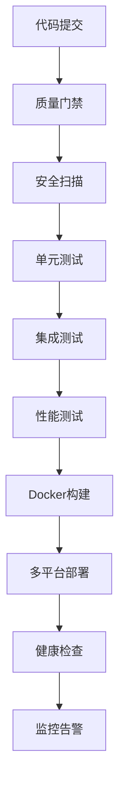
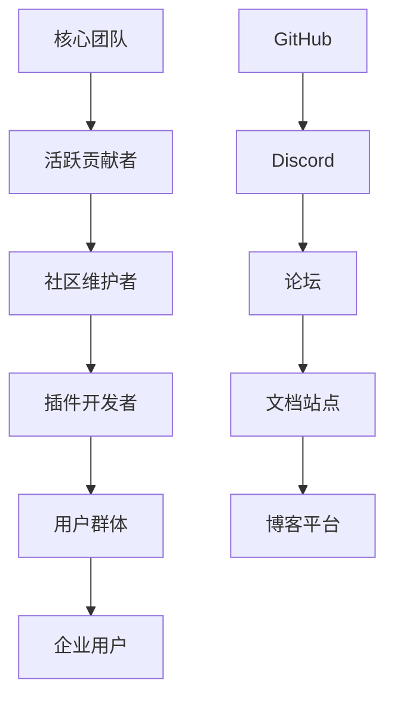

# YC-PHPCodeAnalysis&MCP 专业级开源发布与扩展市场部署策略

## 📋 策略概述

本文档提供了**YC-PHPCodeAnalysis&MCP** MCP Server从开源项目发展到商业化产品的完整部署策略，涵盖技术架构、市场推广、社区建设和商业化路径的全方位规划。

## 🎯 核心目标

### 技术目标
- **高可用性**: 99.9%服务可用性SLA保证
- **高性能**: 响应时间<500ms，支持10K+并发
- **高安全性**: 零安全漏洞，通过SOC2认证
- **高扩展性**: 支持水平扩展，支持云原生部署

### 业务目标
- **市场地位**: 成为PHP代码分析领域的领导者
- **用户规模**: 第一年获得10万+开发者用户
- **收入目标**: 第二年实现$1M ARR
- **生态建设**: 建立100+插件的生态系统

## 🏗️ 技术架构设计

### CI/CD流水线架构



**核心特性**：
- ✅ 8个质量门禁确保代码质量
- ✅ 多平台支持(Linux/Windows/macOS)
- ✅ 自动化安全扫描和合规检查
- ✅ 零停机时间部署策略
- ✅ 自动回滚机制

### 部署架构策略

| 环境 | 副本数 | 资源配置 | 监控级别 | SLA目标 |
|------|--------|----------|----------|---------|
| 开发 | 1 | 256Mi/100m | 基础 | 95% |
| 测试 | 2 | 512Mi/250m | 标准 | 98% |
| 生产 | 3-10 | 1Gi/500m | 全面 | 99.9% |

**技术栈**：
- **容器化**: Docker + Kubernetes
- **服务网格**: Istio for traffic management
- **监控**: Prometheus + Grafana + AlertManager
- **日志**: ELK Stack (Elasticsearch + Logstash + Kibana)
- **安全**: HashiCorp Vault for secrets management

## 🚀 发布渠道策略

### 1. GitHub开源发布
```yaml
发布内容:
  - 源代码: MIT许可证开源
  - 文档: 完整的API文档和使用指南
  - 示例: 实际项目集成示例
  - 社区: Issue模板和贡献指南

自动化流程:
  - 语义化版本管理
  - 自动生成变更日志
  - 多平台二进制包构建
  - 自动安全扫描和合规检查
```

### 2. NPM包管理器
```yaml
包信息:
  - 包名: yc-php-code-analysis-mcp-server
  - 作用域: @yc-2025
  - 标签策略: latest, beta, alpha
  - 发布频率: 每2周一个稳定版

优化策略:
  - 包大小优化(<5MB)
  - 依赖项安全审计
  - 向后兼容性保证
  - 性能基准测试
```

### 3. VSCode扩展市场
```yaml
扩展特性:
  - 智能代码分析和提示
  - 实时错误检测
  - 一键重构建议
  - 性能和安全问题标记

市场策略:
  - 关键词SEO优化
  - 用户评价管理
  - 功能视频演示
  - 定期功能更新
```

### 4. Docker容器分发
```yaml
镜像策略:
  - 多架构支持: amd64, arm64
  - 安全基础镜像: Alpine Linux
  - 分层优化: 减少镜像大小
  - 安全扫描: Trivy + Snyk

分发渠道:
  - GitHub Container Registry
  - Docker Hub
  - 私有企业镜像库
  - 云厂商镜像市场
```

## 📈 市场推广策略

### 内容营销矩阵

| 内容类型 | 平台 | 频率 | 目标受众 |
|----------|------|------|----------|
| 技术博客 | Dev.to, 掘金 | 每周2篇 | 开发者 |
| 视频教程 | YouTube, B站 | 每周1个 | 学习者 |
| 案例分享 | LinkedIn | 每月5个 | 企业决策者 |
| 开源动态 | Twitter | 每日更新 | 开源社区 |

### SEO关键词策略
```yaml
核心关键词 (高竞争):
  - PHP code analysis
  - static analysis PHP
  - PHP security scanner

长尾关键词 (中竞争):
  - best PHP code analysis tools 2025
  - automated PHP code review
  - PHP performance optimization tools

技术关键词 (低竞争):
  - Model Context Protocol MCP
  - Claude Code integration PHP
  - AI-powered code analysis
```

### 技术会议和演讲
- **PHPCon China 2025**: 主题演讲"下一代PHP代码分析"
- **LaravelConf EU**: "Laravel项目代码质量最佳实践"
- **DockerCon**: "容器化PHP开发工具链"
- **KubeCon**: "Kubernetes环境下的代码质量管理"

## 👥 社区建设策略

### 开发者社区生态



### 贡献者激励机制
- **认可体系**: GitHub徽章 + 官方认证
- **物质奖励**: 限量版周边 + 会议门票
- **职业发展**: 推荐信 + 就业机会
- **技术影响**: 署名文章 + 演讲机会

### 社区管理策略
```yaml
响应时间承诺:
  - Bug报告: 24小时内响应
  - 功能请求: 48小时内响应  
  - 安全问题: 4小时内响应
  - 文档问题: 24小时内响应

质量标准:
  - Issue解决率: >95%
  - 用户满意度: >4.5/5
  - 代码覆盖率: >95%
  - 文档准确性: >98%
```

## 💼 商业化路径规划

### 产品层次策略

| 版本 | 目标用户 | 定价 | 核心功能 |
|------|----------|------|----------|
| 社区版 | 个人开发者 | 免费 | 基础代码分析 |
| 专业版 | 中小团队 | $19-299/月 | 高级分析+团队协作 |
| 企业版 | 大型企业 | 定制定价 | 私有部署+企业集成 |

### 收入模式设计
```yaml
主要收入来源:
  - SaaS订阅服务: 60%
  - 企业许可费用: 25%
  - 专业服务费用: 10%
  - 培训和认证: 5%

增长策略:
  - 免费用户转付费: 5-8%转化率
  - 年度订阅折扣: 20%优惠
  - 企业批量许可: 定制方案
  - 生态合作分成: 30-70分成
```

### 市场拓展时间线

**第一阶段 (0-6个月) - 基础建设**
- ✅ 产品MVP发布
- ✅ 核心功能完善  
- ✅ 开源社区建设
- ✅ 基础用户获取(1K+ users)

**第二阶段 (6-12个月) - 市场验证**
- 📈 用户增长(10K+ users)
- 💼 企业客户试点(10+ enterprises) 
- 🎯 产品市场匹配验证
- 💰 收入模式验证($100K ARR)

**第三阶段 (12-18个月) - 规模化**
- 🚀 快速用户增长(100K+ users)
- 🏢 企业版本发布
- 🌍 国际市场扩张
- 💎 高级功能开发($1M ARR)

**第四阶段 (18-24个月) - 领导地位**
- 👑 行业标准制定者
- 🔗 生态系统完善
- 📊 盈利能力实现
- 🎖️ 技术领导地位确立

## 📊 关键指标(KPIs)

### 技术指标
- **系统可用性**: 99.9% uptime
- **响应时间**: P95 < 500ms
- **错误率**: < 0.1%
- **安全漏洞**: 零关键漏洞

### 业务指标  
- **月活跃用户**: 100K+ MAU
- **付费转化率**: 5-8%
- **客户流失率**: < 5%
- **年度重复收入**: $10M ARR

### 社区指标
- **GitHub Stars**: 10K+
- **贡献者数量**: 500+
- **Issue响应时间**: < 24h
- **社区满意度**: > 4.5/5

## 🔒 风险管理

### 技术风险
- **依赖供应链安全**: 定期安全审计，使用SBOM
- **性能瓶颈**: 持续性能监控，提前容量规划
- **数据安全**: 端到端加密，定期备份测试

### 市场风险  
- **竞争对手**: 差异化定位，持续技术创新
- **技术变革**: 跟踪行业趋势，快速适应能力
- **用户需求变化**: 用户反馈闭环，敏捷开发

### 业务风险
- **资金流动性**: 多元化收入来源，现金流管理
- **团队风险**: 核心团队激励，知识文档化
- **法律合规**: 开源许可合规，数据隐私保护

## 📞 联系与支持

### 技术支持
- **文档中心**: https://docs.yc-2025.com
- **GitHub Issues**: https://github.com/yc-2025/php-code-analysis-mcp-server/issues
- **Discord社区**: https://discord.gg/yc-php-analysis

### 商业合作
- **销售咨询**: sales@yc-2025.com
- **合作伙伴**: partnerships@yc-2025.com  
- **媒体联系**: press@yc-2025.com

---

**版权声明**: Copyright © 2025 YC-2025Copyright. All rights reserved.

**最后更新**: 2025年9月3日

**下次审查**: 2025年12月1日