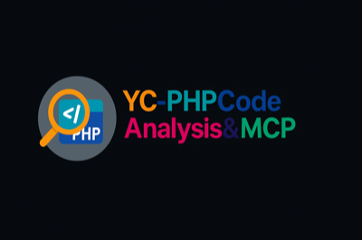

# MCP Integration Guide for YC-PHPCodeAnalysis&MCP

<p align="center">
  
</p>

**English** | [中文](MCP-README.md)

[](https://github.com/hiyco/YC-PHPCodeAnalysis-MCP)
[](https://github.com/hiyco/YC-PHPCodeAnalysis-MCP)

> 🤖 **AI-Enhanced PHP Code Analysis through Model Context Protocol**  
> Comprehensive guide to integrating multiple AI models for intelligent code analysis, optimization, and security auditing.

---

## 🌟 Overview

**YC-PHPCodeAnalysis&MCP** integrates cutting-edge AI capabilities through the Model Context Protocol (MCP), providing intelligent code analysis that goes beyond traditional static analysis. Our platform supports multiple AI providers, enabling context-aware code review, performance optimization, and security vulnerability detection.

### Key Advantages

- **🧠 Multi-AI Intelligence**: Leverage 6 major AI providers simultaneously
- **🎯 Context-Aware Analysis**: AI understands your project's architecture and patterns  
- **⚡ Real-time Insights**: Get instant AI-powered suggestions as you code
- **🔒 Security-First**: AI-driven security vulnerability detection and remediation
- **📊 Performance Optimization**: Intelligent performance analysis and optimization recommendations

---

## 🤖 Supported AI Models

### 🇨🇳 Chinese AI Providers

#### **QWEN (通义千问)**
```json
{
  "provider": "qwen",
  "models": [
    "qwen-turbo",      // Fast responses, good for real-time analysis
    "qwen-plus",       // Balanced performance and quality
    "qwen-max"         // Highest quality, comprehensive analysis
  ],
  "strengths": ["Chinese code comments", "Performance optimization", "Code review"],
  "use_cases": ["Real-time analysis", "Code optimization", "Architecture review"]
}
```

#### **DeepSeek (深度求索)**
```json
{
  "provider": "deepseek",
  "models": [
    "deepseek-coder",  // Specialized for code analysis
    "deepseek-chat"    // General purpose with code capabilities
  ],
  "strengths": ["Code generation", "Bug detection", "Refactoring suggestions"],
  "use_cases": ["Code completion", "Bug fixing", "Code refactoring"]
}
```

#### **Doubao (豆包)**
```json
{
  "provider": "doubao", 
  "models": [
    "doubao-lite",     // Lightweight, fast responses
    "doubao-pro"       // Advanced analysis capabilities
  ],
  "strengths": ["Security analysis", "Vulnerability detection", "Compliance checking"],
  "use_cases": ["Security auditing", "OWASP compliance", "Penetration testing insights"]
}
```

#### **ERNIE (文心一言)**
```json
{
  "provider": "ernie",
  "models": [
    "ernie-3.5",       // Stable, production-ready
    "ernie-4.0"        // Latest with enhanced capabilities
  ],
  "strengths": ["Natural language explanations", "Documentation generation", "Code education"],
  "use_cases": ["Code documentation", "Learning assistance", "Code explanation"]
}
```

### 🌍 International AI Providers

#### **OpenAI GPT**
```json
{
  "provider": "openai",
  "models": [
    "gpt-3.5-turbo",   // Fast, cost-effective
    "gpt-4",           // Highest quality analysis
    "gpt-4-turbo"      // Latest with improved performance
  ],
  "strengths": ["Comprehensive analysis", "Multi-language support", "Advanced reasoning"],
  "use_cases": ["Complex problem solving", "Architecture design", "Code quality assessment"]
}
```

#### **Anthropic Claude**
```json
{
  "provider": "claude",
  "models": [
    "claude-3-haiku",  // Fast, efficient analysis
    "claude-3-sonnet", // Balanced performance
    "claude-3-opus"    // Highest capability model
  ],
  "strengths": ["Safety analysis", "Ethical code review", "Long context understanding"],
  "use_cases": ["Security review", "Ethical guidelines compliance", "Large codebase analysis"]
}
```

---

## 🚀 Quick Setup Guide

### 1. Install MCP Server

#### Using Composer
```bash
# Install the MCP package
composer require yc-php/mcp-server

# Initialize MCP configuration
php bin/pca mcp:init
```

#### Using Docker
```bash
# Pull the MCP server image
docker pull ghcr.io/hiyco/yc-phpcodanalysis-mcp:latest

# Run MCP server
docker run -d \
  --name pca-mcp-server \
  -p 3000:3000 \
  -e MCP_PORT=3000 \
  ghcr.io/hiyco/yc-phpcodanalysis-mcp:latest
```

### 2. Configure AI Providers

#### Interactive Setup (Recommended)
```bash
# Launch interactive configuration
php bin/pca mcp:setup --interactive

# Follow the prompts to configure each provider
? Select AI providers to configure: [QWEN, DeepSeek, OpenAI, Claude]
? Enter QWEN API key: sk-xxx...
? Choose default model for QWEN: qwen-plus
? Enable real-time analysis: Yes
```

#### Manual Configuration
Create `mcp-config.json`:
```json
{
  "mcp": {
    "server": {
      "host": "localhost",
      "port": 3000,
      "timeout": 30
    },
    "providers": {
      "qwen": {
        "enabled": true,
        "api_key": "sk-your-qwen-api-key",
        "model": "qwen-plus",
        "base_url": "https://dashscope.aliyuncs.com/api/v1",
        "features": ["code_review", "optimization", "security"]
      },
      "deepseek": {
        "enabled": true,
        "api_key": "sk-your-deepseek-api-key", 
        "model": "deepseek-coder",
        "base_url": "https://api.deepseek.com/v1",
        "features": ["bug_detection", "refactoring", "completion"]
      },
      "openai": {
        "enabled": true,
        "api_key": "sk-your-openai-api-key",
        "model": "gpt-4",
        "base_url": "https://api.openai.com/v1",
        "features": ["comprehensive_analysis", "architecture_review"]
      },
      "claude": {
        "enabled": true,
        "api_key": "sk-ant-your-claude-api-key",
        "model": "claude-3-sonnet-20240229",
        "base_url": "https://api.anthropic.com/v1",
        "features": ["security_review", "safety_analysis"]
      }
    }
  },
  "analysis": {
    "concurrent_providers": 2,
    "timeout": 30,
    "cache_results": true,
    "cache_duration": 3600
  }
}
```

### 3. Verify Setup
```bash
# Test MCP server connection
php bin/pca mcp:test-connection

# Test AI provider configurations
php bin/pca mcp:test-providers

# Run sample analysis
php bin/pca analyze examples/sample.php --ai-enabled
```

---

## 💡 Usage Examples

### Basic AI-Enhanced Analysis

#### Command Line Interface
```bash
# AI code review with default provider
pca ai:review src/UserController.php

# Multi-provider analysis for comprehensive insights
pca ai:analyze src/PaymentService.php --providers=qwen,claude,gpt4

# Security-focused analysis
pca ai:security src/ --provider=doubao --level=strict

# Performance optimization suggestions
pca ai:optimize src/DatabaseManager.php --provider=deepseek
```

#### PHP API Integration
```php
<?php
use YcPca\Mcp\AnalysisClient;
use YcPca\Mcp\Providers\QwenProvider;

// Initialize MCP client
$client = new AnalysisClient([
    'server_url' => 'http://localhost:3000',
    'timeout' => 30
]);

// Single provider analysis
$qwen = new QwenProvider('sk-your-api-key', 'qwen-plus');
$result = $client->analyze('src/User.php', $qwen);

echo "Security Issues: " . count($result->getSecurityIssues()) . "\n";
echo "Performance Suggestions: " . count($result->getOptimizations()) . "\n";
echo "Code Quality Score: " . $result->getQualityScore() . "/10\n";

// Multi-provider consensus analysis
$providers = ['qwen', 'deepseek', 'claude'];
$consensus = $client->consensusAnalysis('src/CriticalService.php', $providers);

foreach ($consensus->getHighConfidenceIssues() as $issue) {
    echo "Issue: {$issue->getDescription()}\n";
    echo "Confidence: {$issue->getConfidence()}%\n";
    echo "Suggested Fix: {$issue->getSuggestion()}\n\n";
}
```

### Advanced Analysis Scenarios

#### 1. Security Vulnerability Assessment
```php
<?php
// Comprehensive security analysis with multiple AI models
$securityAnalyzer = new SecurityAnalyzer([
    'providers' => ['doubao', 'claude', 'gpt4'],
    'ruleset' => 'OWASP_TOP_10',
    'severity_threshold' => 'MEDIUM'
]);

$vulnerabilities = $securityAnalyzer->scanProject('./src');

foreach ($vulnerabilities as $vuln) {
    echo "File: {$vuln->getFile()}:{$vuln->getLine()}\n";
    echo "Type: {$vuln->getType()}\n";
    echo "Severity: {$vuln->getSeverity()}\n";
    echo "Description: {$vuln->getDescription()}\n";
    
    // AI-generated fix suggestions
    $fixes = $vuln->getAIFixSuggestions();
    foreach ($fixes as $fix) {
        echo "Suggested Fix ({$fix->getProvider()}): {$fix->getSolution()}\n";
    }
    echo "\n";
}
```

#### 2. Performance Optimization
```php
<?php
// AI-driven performance analysis and optimization
$optimizer = new PerformanceOptimizer([
    'providers' => ['deepseek', 'qwen'],
    'focus_areas' => ['database', 'algorithms', 'memory_usage'],
    'optimization_level' => 'aggressive'
]);

$optimizations = $optimizer->analyzeFile('src/DataProcessor.php');

foreach ($optimizations as $optimization) {
    echo "Performance Issue: {$optimization->getIssue()}\n";
    echo "Current Complexity: {$optimization->getCurrentComplexity()}\n";
    echo "Optimized Approach: {$optimization->getOptimizedApproach()}\n";
    echo "Expected Improvement: {$optimization->getImprovementEstimate()}\n";
    
    // Auto-generate optimized code
    if ($optimization->canAutoOptimize()) {
        $optimizedCode = $optimization->generateOptimizedCode();
        echo "Optimized Code:\n{$optimizedCode}\n";
    }
    echo "\n";
}
```

#### 3. Architecture Review
```php
<?php
// AI-powered architecture analysis
$architectAnalyzer = new ArchitectureAnalyzer([
    'providers' => ['gpt4', 'claude'],
    'analysis_depth' => 'comprehensive',
    'design_patterns' => true,
    'solid_principles' => true
]);

$review = $architectAnalyzer->reviewProject('./src');

echo "Architecture Score: {$review->getOverallScore()}/100\n";
echo "Design Pattern Compliance: {$review->getDesignPatternScore()}%\n";
echo "SOLID Principles Adherence: {$review->getSolidScore()}%\n";

foreach ($review->getRecommendations() as $recommendation) {
    echo "Area: {$recommendation->getArea()}\n";
    echo "Issue: {$recommendation->getIssue()}\n";
    echo "Suggested Improvement: {$recommendation->getSuggestion()}\n";
    echo "Priority: {$recommendation->getPriority()}\n\n";
}
```

---

## 🔧 Advanced Configuration

### Provider-Specific Settings

#### QWEN Configuration
```json
{
  "qwen": {
    "api_key": "sk-your-api-key",
    "model": "qwen-max",
    "temperature": 0.1,
    "max_tokens": 4000,
    "top_p": 0.8,
    "repetition_penalty": 1.1,
    "custom_instructions": "Focus on PHP best practices and security",
    "response_format": "structured",
    "enable_tools": true
  }
}
```

#### OpenAI Configuration  
```json
{
  "openai": {
    "api_key": "sk-your-api-key",
    "model": "gpt-4-turbo-preview",
    "temperature": 0.2,
    "max_tokens": 4000,
    "frequency_penalty": 0.1,
    "presence_penalty": 0.1,
    "system_prompt": "You are an expert PHP developer focused on code quality and security",
    "tools": ["code_interpreter", "function_calling"]
  }
}
```

#### Claude Configuration
```json
{
  "claude": {
    "api_key": "sk-ant-your-api-key",
    "model": "claude-3-sonnet-20240229", 
    "max_tokens": 4000,
    "temperature": 0.1,
    "top_p": 0.9,
    "system_prompt": "Analyze PHP code with focus on security, performance, and maintainability",
    "safety_settings": {
      "block_unsafe_content": true,
      "filter_level": "strict"
    }
  }
}
```

### Analysis Workflows

#### Custom Analysis Pipeline
```php
<?php
// Define custom analysis workflow
$workflow = new AnalysisWorkflow([
    'stages' => [
        'syntax_check' => [
            'providers' => ['deepseek'],
            'parallel' => false,
            'required' => true
        ],
        'security_scan' => [
            'providers' => ['doubao', 'claude'],
            'parallel' => true,
            'consensus_required' => true,
            'confidence_threshold' => 0.8
        ],
        'performance_analysis' => [
            'providers' => ['qwen', 'gpt4'],
            'parallel' => true,
            'optimization_level' => 'moderate'
        ],
        'code_quality' => [
            'providers' => ['claude', 'gpt4'],
            'parallel' => true,
            'standards' => ['PSR-12', 'SOLID']
        ]
    ],
    'error_handling' => 'continue_on_failure',
    'results_aggregation' => 'weighted_consensus'
]);

$results = $workflow->execute('src/');
```

### Performance Tuning

#### Caching Strategy
```json
{
  "cache": {
    "enabled": true,
    "driver": "redis",
    "connection": {
      "host": "localhost",
      "port": 6379,
      "password": null,
      "database": 0
    },
    "ttl": {
      "analysis_results": 3600,
      "ai_responses": 7200,
      "file_signatures": 86400
    },
    "strategies": {
      "invalidation": "smart",
      "compression": "gzip",
      "serialization": "json"
    }
  }
}
```

#### Concurrent Processing
```json
{
  "concurrency": {
    "max_concurrent_requests": 5,
    "provider_parallelism": 3,
    "file_batch_size": 10,
    "queue_system": "redis",
    "worker_processes": 4,
    "timeout_handling": {
      "request_timeout": 30,
      "connection_timeout": 10,
      "retry_attempts": 3,
      "backoff_strategy": "exponential"
    }
  }
}
```

---

## 📊 Monitoring & Analytics

### Real-time Monitoring Dashboard

#### Start Monitoring Server
```bash
# Start monitoring dashboard
php bin/pca monitor:start --port=8080

# View real-time analytics
open http://localhost:8080/dashboard
```

#### Key Metrics Tracked
- **API Response Times**: Per provider performance metrics
- **Analysis Accuracy**: Confidence scores and validation results
- **Resource Usage**: Memory, CPU, and network utilization
- **Error Rates**: Failed requests and error categorization
- **Cost Analysis**: Token usage and API costs per provider

### Analytics Integration
```php
<?php
// Custom analytics integration
$analytics = new AnalyticsCollector([
    'providers' => ['all'],
    'metrics' => ['accuracy', 'performance', 'cost'],
    'storage' => 'elasticsearch',
    'real_time' => true
]);

// Track analysis session
$session = $analytics->startSession('project_analysis');
$results = $client->analyze('src/', ['qwen', 'claude']);
$analytics->endSession($session, $results);

// Generate insights
$insights = $analytics->generateInsights([
    'time_period' => 'last_30_days',
    'groupby' => 'provider',
    'metrics' => ['accuracy', 'cost_per_analysis']
]);
```

---

## 🛠️ Troubleshooting

### Common Issues and Solutions

#### 1. API Key Authentication Errors
```bash
# Verify API key configuration
php bin/pca mcp:test-auth --provider=qwen

# Reset provider configuration
php bin/pca mcp:reset-config --provider=qwen --interactive
```

#### 2. Connection Timeout Issues
```json
{
  "timeout_config": {
    "connection_timeout": 15,
    "read_timeout": 45,
    "retry_count": 3,
    "retry_delay": 1000,
    "circuit_breaker": {
      "failure_threshold": 5,
      "recovery_timeout": 30,
      "half_open_max_calls": 3
    }
  }
}
```

#### 3. Rate Limiting Handling
```php
<?php
// Configure rate limiting
$rateLimiter = new RateLimiter([
    'qwen' => ['requests_per_minute' => 60, 'tokens_per_minute' => 100000],
    'openai' => ['requests_per_minute' => 40, 'tokens_per_minute' => 150000],
    'claude' => ['requests_per_minute' => 50, 'tokens_per_minute' => 120000]
]);

$client->setRateLimiter($rateLimiter);
```

#### 4. Memory and Performance Issues
```bash
# Monitor resource usage
php bin/pca monitor:resources --realtime

# Optimize for memory usage
php bin/pca analyze src/ --memory-limit=512M --batch-size=5

# Enable result streaming for large projects
php bin/pca analyze src/ --stream-results --chunk-size=1MB
```

### Debug Mode
```bash
# Enable debug logging
php bin/pca analyze src/ --debug --log-level=debug

# Trace API calls
php bin/pca analyze src/ --trace-api-calls --output-trace=trace.log

# Profile performance
php bin/pca analyze src/ --profile --profile-output=profile.json
```

---

## 🔒 Security Considerations

### API Key Management
```json
{
  "security": {
    "api_keys": {
      "encryption": "AES-256-GCM",
      "storage": "encrypted_env",
      "rotation": "monthly",
      "audit_logging": true
    },
    "network": {
      "tls_version": "1.3",
      "certificate_validation": true,
      "proxy_support": true
    },
    "data_handling": {
      "code_privacy": "strict",
      "data_retention": "24_hours",
      "anonymization": true,
      "gdpr_compliance": true
    }
  }
}
```

### Data Privacy Configuration
```php
<?php
// Configure privacy settings
$privacySettings = [
    'anonymize_code' => true,
    'strip_comments' => true,
    'hash_identifiers' => true,
    'exclude_patterns' => [
        '/password/i',
        '/secret/i', 
        '/token/i',
        '/key/i'
    ],
    'data_residency' => 'local',
    'audit_trail' => true
];

$client->setPrivacySettings($privacySettings);
```

---

## 📚 API Reference

### Core MCP Client API

#### AnalysisClient
```php
<?php
class AnalysisClient
{
    public function __construct(array $config);
    
    // Single file analysis
    public function analyze(string $file, $provider = null): AnalysisResult;
    
    // Batch analysis
    public function analyzeBatch(array $files, array $providers = []): BatchResult;
    
    // Project-wide analysis
    public function analyzeProject(string $path, array $options = []): ProjectResult;
    
    // Consensus analysis with multiple providers
    public function consensusAnalysis(string $target, array $providers): ConsensusResult;
    
    // Real-time analysis (streaming)
    public function analyzeStream(string $code, callable $callback): void;
}
```

#### Provider Management
```php
<?php
class ProviderManager
{
    public function registerProvider(string $name, ProviderInterface $provider): void;
    public function getProvider(string $name): ProviderInterface;
    public function listProviders(): array;
    public function testProvider(string $name): TestResult;
    public function getProviderStats(string $name): ProviderStats;
}
```

#### Result Objects
```php
<?php
class AnalysisResult
{
    public function getSecurityIssues(): array;
    public function getPerformanceIssues(): array;
    public function getQualityIssues(): array;
    public function getSuggestions(): array;
    public function getOverallScore(): float;
    public function toArray(): array;
    public function toJson(): string;
}

class SecurityIssue
{
    public function getType(): string;
    public function getSeverity(): string;
    public function getDescription(): string;
    public function getLine(): int;
    public function getColumn(): int;
    public function getSuggestion(): string;
    public function getCWEId(): ?string;
}
```

---

## 🎓 Best Practices

### 1. Provider Selection Strategy
```php
<?php
// Choose providers based on analysis type
$providerStrategy = [
    'security_analysis' => ['doubao', 'claude'],        // Security-focused providers
    'performance_tuning' => ['deepseek', 'qwen'],       // Performance-oriented
    'code_review' => ['gpt4', 'claude', 'qwen'],        // Comprehensive review
    'quick_feedback' => ['qwen', 'deepseek'],           // Fast response providers
    'architecture_review' => ['gpt4', 'claude']         // High-level analysis
];
```

### 2. Cost Optimization
```php
<?php
// Smart cost management
$costOptimizer = [
    'use_cache_aggressively' => true,
    'prefer_efficient_models' => ['qwen-turbo', 'claude-haiku'],
    'batch_similar_analyses' => true,
    'skip_unchanged_files' => true,
    'progressive_analysis' => [
        'first_pass' => 'fast_models',      // Quick scan with efficient models
        'second_pass' => 'thorough_models'  // Detailed analysis only for issues
    ]
];
```

### 3. Quality Assurance
```php
<?php
// Multi-provider validation
$qualityAssurance = [
    'minimum_providers' => 2,
    'confidence_threshold' => 0.7,
    'consensus_requirement' => 0.8,
    'validation_rules' => [
        'security_issues' => 'require_consensus',
        'performance_issues' => 'single_provider_ok',
        'style_issues' => 'majority_vote'
    ]
];
```

---

## 📈 Roadmap

### Upcoming Features
- **🔮 Predictive Analysis**: AI-powered prediction of potential future issues
- **🤝 Team Collaboration**: Shared AI analysis results and team insights
- **📱 Mobile Dashboard**: Mobile app for monitoring and notifications
- **🔗 IDE Integrations**: JetBrains, Sublime Text, and Vim plugins
- **📊 Advanced Analytics**: Machine learning-powered trend analysis

### Integration Plans
- **🎯 GitHub Copilot**: Enhanced integration with GitHub's AI coding assistant  
- **🤖 Custom Models**: Support for fine-tuned and private AI models
- **🌐 Multi-language**: Extend support to JavaScript, Python, and Java
- **☁️ Cloud Platform**: Hosted analysis service with enterprise features

---

## 🤝 Community

### Contributing to MCP Integration
We welcome contributions to improve AI integration:

- **Provider Plugins**: Add support for new AI providers
- **Analysis Algorithms**: Enhance AI result processing and consensus algorithms
- **Performance Optimizations**: Improve caching and concurrent processing
- **Documentation**: Help improve guides and examples

### Community Resources
- **Discord Server**: [Join our community](https://discord.gg/yc-php-mcp)
- **Weekly Demos**: Live demonstrations every Friday
- **Contributing Guide**: [Detailed contribution guidelines](CONTRIBUTING.md)
- **Provider SDK**: [Build your own AI provider](docs/provider-sdk.md)

---

<div align="center">

**🚀 Powered by AI, Built for Developers**

Experience the future of PHP code analysis with AI-enhanced insights and intelligent automation.

[🌟 Star on GitHub](https://github.com/hiyco/YC-PHPCodeAnalysis-MCP) | [📖 Full Documentation](https://docs.yc-php.com/mcp) | [💬 Join Discord](https://discord.gg/yc-php-mcp)

</div>