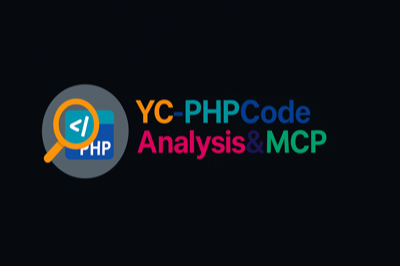

# YC-PHPCodeAnalysis&MCP - MCP-PHP SDK

<p align="center">
  
</p>

**中文** | [English](MCP-README-EN.md)

## 🚀 概述

**YC-PHPCodeAnalysis&MCP** 集成了完整的 **Model Context Protocol (MCP)** PHP SDK，支持与主流大语言模型的无缝集成。本项目结合了传统的PHP代码分析功能和现代AI集成能力，MCP是一个标准化协议，用于AI助手与各种数据源和工具的集成。

### ✨ 核心特性

- **🤖 多模型支持**: 集成阿里QWEN、DeepSeek、字节豆包、百度文心一言、OpenAI、Claude等主流模型
- **🔧 MCP协议**: 完整的MCP服务器/客户端实现，遵循官方规范
- **🛠️ 丰富工具**: 内置文件操作、系统命令、数据处理等工具
- **📡 多传输层**: 支持STDIO、WebSocket、HTTP等传输协议
- **🔍 类型安全**: 严格类型声明，完整的PHPDoc注释
- **📝 完整文档**: 详细的使用文档和示例代码

## 🏗️ 架构设计

```
YC-PHPCodeAnalysis&MCP
├── src/Analysis/       # 传统代码分析功能
│   ├── Static/         # 静态分析
│   ├── Quality/        # 代码质量检查
│   └── Metrics/        # 代码度量
├── src/Mcp/           # MCP协议层
│   ├── Protocol/      # JSON-RPC 2.0消息处理
│   ├── Model/         # AI模型提供商
│   │   ├── Providers/ # 各厂商SDK实现
│   │   └── Factory    # 统一模型工厂
│   ├── Server/        # MCP服务器
│   │   ├── McpServer  # 核心服务器实现
│   │   └── Tools/     # 内置工具集合
│   └── Transport/     # 传输层抽象
└── CLI/               # 命令行工具
```

## 🚀 快速开始

### 安装依赖

```bash
composer install
```

### 基础使用

```php
<?php
require_once 'vendor/autoload.php';

use YcPca\Mcp\Model\ModelProviderFactory;

// 创建QWEN提供商
$provider = ModelProviderFactory::create('qwen', [
    'api_key' => 'your-api-key'
]);

// 发送请求
$response = $provider->complete('你好，请介绍一下PHP');
echo $response->getContent();
```

## 🤖 支持的AI模型

### 🇨🇳 国产模型

| 提供商 | 模型 | 上下文长度 | 认证方式 |
|--------|------|-----------|---------|
| **阿里 QWEN** | qwen-turbo<br>qwen-plus<br>qwen-max | 8K-30K | API Key |
| **DeepSeek** | deepseek-chat<br>deepseek-coder | 16K-32K | API Key |
| **字节豆包** | doubao-lite-4k<br>doubao-pro-32k | 4K-32K | API Key |
| **百度文心** | ernie-bot-turbo<br>ernie-bot-4 | 8K | API Key + Secret |

### 🌍 国际模型

| 提供商 | 模型 | 上下文长度 | 认证方式 |
|--------|------|-----------|---------|
| **OpenAI** | gpt-3.5-turbo<br>gpt-4<br>gpt-4o | 16K-128K | API Key |
| **Anthropic** | claude-3-haiku<br>claude-3-sonnet<br>claude-3-opus | 200K | API Key |

## 🔧 MCP服务器功能

### 内置工具

- **文件操作**: `read_file`, `write_file`, `list_directory`
- **系统操作**: `execute_command`, `system_info`
- **数据处理**: `format_json`, `base64`, `hash`
- **AI集成**: `ai_chat`, `ai_model_info`

### 自定义工具示例

```php
$server->registerTool(
    'analyze_code',
    function (array $args): string {
        $code = $args['code'];
        $language = $args['language'] ?? 'php';
        
        // 使用AI分析代码
        $provider = ModelProviderFactory::create('qwen', [
            'api_key' => getenv('QWEN_API_KEY')
        ]);
        
        $prompt = "请分析以下{$language}代码的质量和问题：\n\n```{$language}\n{$code}\n```";
        $response = $provider->complete($prompt);
        
        return $response->getContent();
    },
    [
        'type' => 'object',
        'properties' => [
            'code' => ['type' => 'string', 'description' => '要分析的代码'],
            'language' => ['type' => 'string', 'description' => '编程语言']
        ],
        'required' => ['code']
    ],
    '使用AI分析代码质量'
);
```

## 📖 详细使用指南

### 1. AI模型调用

```php
// 基础聊天
$response = $provider->chat([
    ['role' => 'user', 'content' => '什么是MCP协议？']
]);

// 流式响应
foreach ($provider->streamComplete('写一首关于AI的诗') as $chunk) {
    echo $chunk->getContent();
    flush();
}

// 获取模型信息
$info = $provider->getModelInfo('qwen-turbo');
print_r($info);

// 测试连接
if ($provider->testConnection()) {
    echo "连接成功！";
}
```

### 2. MCP服务器部署

```php
#!/usr/bin/env php
<?php
require_once 'vendor/autoload.php';

use YcPca\Mcp\Server\McpServer;
use YcPca\Mcp\Server\Tools\BuiltinTools;

$server = new McpServer();

// 注册内置工具
BuiltinTools::registerAll($server);

// 注册自定义资源
$server->registerResource(
    'config://database',
    function (string $uri): array {
        return [
            'host' => 'localhost',
            'database' => 'myapp',
            'charset' => 'utf8mb4'
        ];
    }
);

// 启动服务器
$server->start();
```

### 3. 错误处理和日志

```php
use Monolog\Logger;
use Monolog\Handler\StreamHandler;

$logger = new Logger('mcp');
$logger->pushHandler(new StreamHandler('mcp.log', Logger::INFO));

try {
    $provider = ModelProviderFactory::create('qwen', [
        'api_key' => 'your-key'
    ], $logger);
    
    $response = $provider->complete('Hello');
    
} catch (McpModelException $e) {
    $logger->error('模型错误', ['error' => $e->getMessage()]);
} catch (McpException $e) {
    $logger->error('MCP错误', ['error' => $e->getMessage()]);
}
```

## 🧪 测试

```bash
# 运行所有测试
./vendor/bin/phpunit

# 运行MCP测试
./vendor/bin/phpunit --testsuite="MCP Tests"

# 生成覆盖率报告
./vendor/bin/phpunit --coverage-html coverage/
```

## 🔧 配置说明

### 环境变量

```bash
# API密钥配置
QWEN_API_KEY=your_qwen_api_key
DEEPSEEK_API_KEY=your_deepseek_api_key
DOUBAO_API_KEY=your_doubao_api_key
ERNIE_API_KEY=your_ernie_api_key
ERNIE_SECRET_KEY=your_ernie_secret_key
OPENAI_API_KEY=your_openai_api_key
CLAUDE_API_KEY=your_claude_api_key

# MCP服务器配置
MCP_SERVER_NAME="PHP-MCP-Server"
MCP_SERVER_VERSION="1.0.0"
MCP_TIMEOUT=30
```

### 配置文件示例

```php
return [
    'providers' => [
        'qwen' => [
            'api_key' => env('QWEN_API_KEY'),
            'model' => 'qwen-turbo',
            'temperature' => 0.7,
            'timeout' => 30
        ],
        'deepseek' => [
            'api_key' => env('DEEPSEEK_API_KEY'),
            'model' => 'deepseek-chat',
            'temperature' => 0.8
        ]
    ],
    'server' => [
        'name' => env('MCP_SERVER_NAME', 'PHP-MCP-Server'),
        'version' => env('MCP_SERVER_VERSION', '1.0.0'),
        'timeout' => env('MCP_TIMEOUT', 30)
    ]
];
```

## 📁 项目结构

```
/src/Mcp/
├── McpSdk.php                 # SDK主入口
├── McpException.php           # MCP异常类
├── McpModelException.php      # 模型异常类
├── Protocol/
│   └── McpProtocol.php       # MCP协议实现
├── Transport/
│   ├── TransportInterface.php # 传输接口
│   ├── StdioTransport.php    # STDIO传输
│   └── WebSocketTransport.php # WebSocket传输
├── Model/
│   ├── ModelProviderInterface.php # 模型接口
│   ├── CompletionResponse.php     # 响应类
│   ├── ModelProviderFactory.php  # 模型工厂
│   └── Providers/
│       ├── QwenProvider.php      # QWEN实现
│       ├── DeepSeekProvider.php  # DeepSeek实现
│       ├── DoubaoProvider.php    # 豆包实现
│       ├── ErnieProvider.php     # 文心实现
│       ├── OpenAIProvider.php    # OpenAI实现
│       └── ClaudeProvider.php    # Claude实现
└── Server/
    ├── McpServer.php          # MCP服务器
    └── Tools/
        └── BuiltinTools.php   # 内置工具
```

## 🤝 贡献指南

1. Fork 项目
2. 创建功能分支 (`git checkout -b feature/AmazingFeature`)
3. 提交更改 (`git commit -m 'Add some AmazingFeature'`)
4. 推送到分支 (`git push origin feature/AmazingFeature`)
5. 开启 Pull Request

## 📄 许可证

本项目采用 MIT 许可证 - 查看 [LICENSE](LICENSE) 文件了解详情。

## 🔗 相关链接

- [MCP 官方规范](https://github.com/modelcontextprotocol/specification)
- [项目主页](https://github.com/hiyco/YC-PHPCodeAnalysis-MCP)
- [问题报告](https://github.com/hiyco/YC-PHPCodeAnalysis-MCP/issues)
- [文档中心](https://github.com/hiyco/YC-PHPCodeAnalysis-MCP/blob/main/docs)

## 📞 支持

如有问题或建议，请通过以下方式联系：

- 📧 邮箱: support@your-domain.com
- 💬 QQ群: 123456789
- 🐛 Issues: [GitHub Issues](https://github.com/hiyco/YC-PHPCodeAnalysis-MCP/issues)

---

**⭐ 如果这个项目对你有帮助，请给个Star支持！**

*最后更新: 2025-01-15*