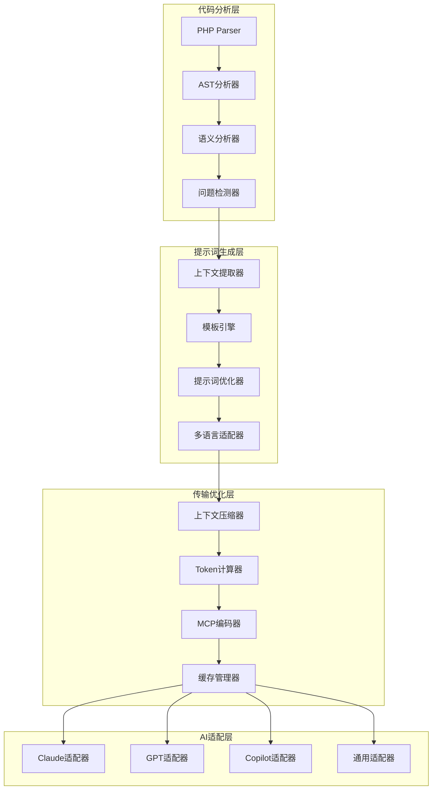

# MCP上下文提示词系统架构

## 系统架构总览



## 核心组件说明

### 1. 代码分析层
- **PHP Parser**: 解析PHP代码生成AST
- **AST分析器**: 遍历和分析抽象语法树
- **语义分析器**: 理解代码语义和上下文
- **问题检测器**: 识别安全、性能、质量问题

### 2. 提示词生成层
- **上下文提取器**: 从分析结果提取关键信息
- **模板引擎**: 动态生成结构化提示词
- **提示词优化器**: 优化长度和相关性
- **多语言适配器**: 支持中英文切换

### 3. 传输优化层
- **上下文压缩器**: 压缩冗余信息
- **Token计算器**: 精确计算token消耗
- **MCP编码器**: 标准化MCP协议封装
- **缓存管理器**: 智能缓存和复用

### 4. AI适配层
- **特定适配器**: 针对不同AI工具优化
- **通用适配器**: 标准化接口支持

## 数据流设计

```yaml
pipeline:
  input:
    - source_code: PHP源代码
    - analysis_config: 分析配置
    - user_preferences: 用户偏好
    
  processing:
    - stage1: 代码解析和分析
    - stage2: 问题识别和分类
    - stage3: 上下文提取和优化
    - stage4: 提示词生成和适配
    - stage5: 传输编码和缓存
    
  output:
    - prompt: 优化后的提示词
    - context: 压缩的上下文数据
    - metadata: 元数据和配置
```

## 模块化设计

### 核心模块
1. **PromptGenerator**: 提示词生成核心
2. **ContextManager**: 上下文管理器
3. **TemplateEngine**: 模板处理引擎
4. **OptimizationEngine**: 优化引擎
5. **AdapterFactory**: 适配器工厂

### 扩展模块
1. **CustomRuleEngine**: 自定义规则引擎
2. **FeedbackProcessor**: 反馈处理器
3. **MetricsCollector**: 指标收集器
4. **CacheStrategy**: 缓存策略
5. **SecurityValidator**: 安全验证器